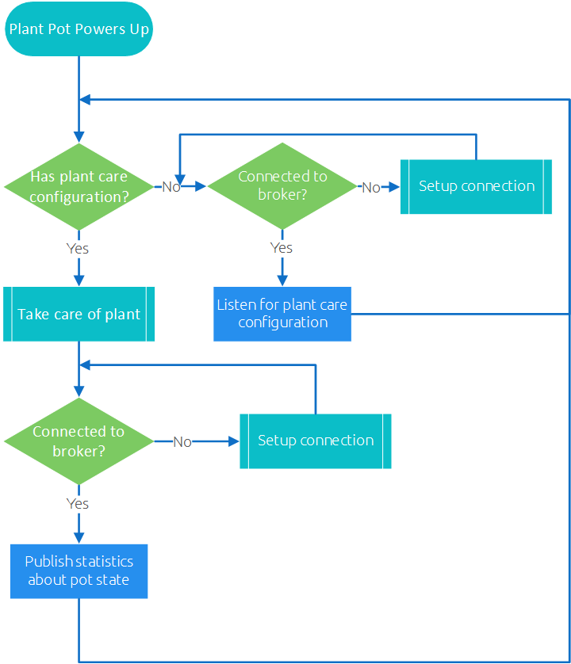
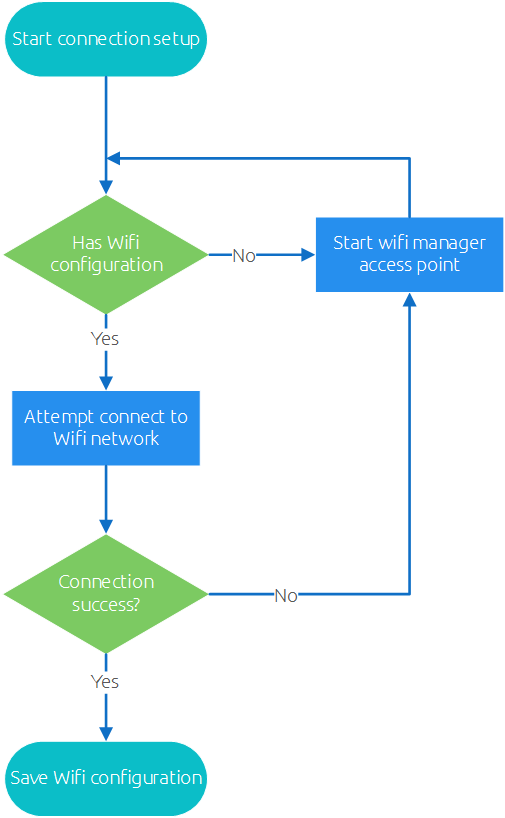
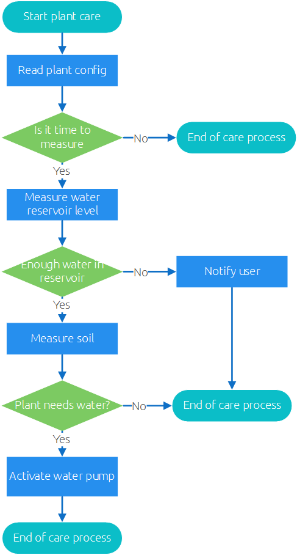

# Flow of the plant pot software
This document shows the decision flow of the software using flow charts.

## The main process
This flowchart shows the main process of the plant pot. It contains multiple subprocess defined
below.

## The connection process
This flowchart shows the process of connecting to the wifi network and MQTT broker.

## The plant care process
This flowchart shows the process of taking care of an plant in the pot.

